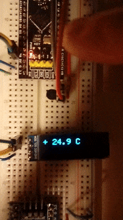

## TMP36 temperature sensor

Temperature is read every second from the analog TMP36 sensor and displayed on an OLED display.

* Correctly handles temperatures below zero.

* Button press switches between Celsius and Fahrenheit degrees.

* Conversion factor can be adjusted according to the ADC resolution and Vcc voltage used.

"Business logic": get an accurate reading by sampling 12 times and dropping the two biggest and two smallest values,
then averaging the remaining 8.

"Presentation logic": to make the displayed value more stable for the user, average the last 8 temperature values.

How to use a TMP36 sensor: https://learn.adafruit.com/tmp36-temperature-sensor/using-a-temp-sensor

Improved following the STMicroelectronics Application Note AN4073 "How to improve ADC accuracy".

_TO DO: add custom font (7-segment digits)_
